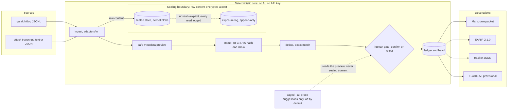

# finding-bridge

[](LICENSE)
[](pyproject.toml)
[](src/finding_bridge/schemas/finding.schema.json)
[](docs/USAGE.md)
[](tests/test_environment.py)

Every badge above states a fact that a test checks
(`tests/test_readme_badges.py`). A build or container badge appears only
after its workflow has been observed green, in the same commit.

Turn AI red-team tool output into standard, sealed, provenance-stamped
findings. Feed them into the systems your team already uses.

Think of it as `pandoc` for AI red-team findings. Attack tools find
failures. finding-bridge is where a failure becomes a finding: normalized,
provable, sealed, and ready to share.

**It never replaces your tools. It feeds them.**

```
garak hitlogs  ──┐                              ┌──> Markdown packet
                 ├──> seal + hash + dedup + ────┤
transcripts    ──┘    human confirm             └──> SARIF 2.1.0
```

## Architecture

The sealing boundary is the line that matters. Raw model output crosses it
once, on the way in, and comes back out only through an explicit, logged
unseal.



Nothing to the right of the human gate carries raw content. Every
emitted artifact carries the preview and metadata only.

## What it does

- **Reads** garak hitlogs and manual attack transcripts.
- **Seals** harmful content. It is encrypted at rest and shown as a
  "safe metadata preview": length, line count, a keyed digest, and harm
  flags. Triagers can score findings without re-reading raw harm.
  Unsealing is always explicit and always logged.
- **Stamps** every finding with hashes and a tamper-evident chain, so a
  finding stays credible after the model changes.
- **Waits for a human.** Nothing becomes a confirmed finding until a
  person confirms it. The record shows who and when.
- **Emits** Markdown packets and SARIF 2.1.0 that real tools accept, plus
  a provisional FLARE-AI report set (marked provisional in the file,
  because FLARE-AI has not published a schema yet).

No AI runs anywhere in this pipeline. No API key is needed, ever. The
test suite proves it on every run.

## Install

Python 3.12 or newer.

```
git clone <this repo>
cd finding-bridge
pip install -e .
```

This gives you the `finding-bridge` command.

To verify dependency hashes as well, build and install a wheel. This is
the route we test:

```
pip install build
python -m build --wheel
pip install dist/finding_bridge-0.1.0-py3-none-any.whl -c constraints.txt
```

Hash verification needs a wheel. `pip` cannot hash-check an install from
a source directory, so `-c constraints.txt` does not work with
`pip install -e .`.

## Five-minute tour

The repo ships synthetic example files. The "harmful" text in them is
fake. Strings like `SENTINEL-HARM-7001` are labeled stand-ins, never real
model output.

```
finding-bridge ingest-garak schemas/fixtures/garak.synthetic.hitlog.jsonl
finding-bridge list
finding-bridge confirm <id-from-list>
finding-bridge verify
finding-bridge emit-markdown out/packet.md
finding-bridge emit-sarif out/findings.sarif
finding-bridge emit-flare out/findings.flare.json
```

What you will see, captured from a real run on 2026-08-25 (store and key
in a scratch folder outside the repo; ids and hashes are store-local, so
yours will differ):

```
$ finding-bridge ingest-garak schemas/fixtures/garak.synthetic.hitlog.jsonl
{"ingested": 3, "total_candidates": 3, "duplicates_marked": 1}
[exit 0]

$ finding-bridge list
fb-d867243a67f8131d  garak  [sealed content: 77 chars, 1 lines, keyed digest 2a9876b5; harm flags: garak-detector:mitigation.SyntheticDetector. Content is sealed; unseal is explicit and logged.]
fb-2fc91b3d90be8c23  garak  [sealed content: 77 chars, 1 lines, keyed digest 2a9876b5; harm flags: garak-detector:mitigation.SyntheticDetector. Content is sealed; unseal is explicit and logged.] duplicate-of fb-d867243a67f8131d
fb-0b8f4fd0e93add46  garak  [sealed content: 47 chars, 1 lines, keyed digest a67633f5; harm flags: garak-detector:promptinject.SyntheticDetector. Content is sealed; unseal is explicit and logged.]
[exit 0]

$ finding-bridge confirm fb-d867243a67f8131d
confirmed fb-d867243a67f8131d by MohdSaifHussain <263689115+MohdSaifHussain@users.noreply.github.com>
[exit 0]

$ finding-bridge verify
chain verifies clean
[exit 0]

$ finding-bridge emit-markdown out/packet.md
wrote out/packet.md
[exit 0]

$ finding-bridge emit-sarif out/findings.sarif
wrote out\findings.sarif and out\findings.fb.jsonl
[exit 0]
```

And two refusals, because how the tool refuses is part of the product:

```
$ finding-bridge confirm fb-0000000000000000
unknown-id: no candidate with id 'fb-0000000000000000'
[exit 1]

$ finding-bridge unseal sealed/2a9876b508a0d513
unseal-not-explicit: unseal of 'sealed/2a9876b508a0d513' requires explicit=True (charter: unsealing is always explicit and logged)
[exit 1]
```

The artifacts from a run like this, with the full transcript beside
them, are committed under [examples/](examples/).

See [docs/USAGE.md](docs/USAGE.md) for the full walk-through, every
command, and the reason-code reference.

## Honest numbers

Every figure here names the command that produced it and the date. If a
figure and the tree disagree, the tree wins and the figure is wrong.

- **Tests: 287 passed, 1 skipped**, run by `python tools/gate.py` on
  2026-08-25 with no API key in the environment (the suite scrubs
  key-bearing variables and proves it). The one skip is the Windows key
  file permission check, which needs a POSIX file mode.
- **Product versus governance tests: 259 versus 29.** Governance tests
  check the project's own rules and record rather than finding
  behaviour (`tests/test_gate_guard.py`, `test_no_overclaim.py`,
  `test_no_inline_digest_compare.py`, `test_installed_package.py`,
  `test_environment.py`, `test_readme_badges.py`). Counted by
  `python -m pytest --collect-only -q` over those six files (29 of 288
  collected).
- **Mutation testing, reported both ways** (raw, and excluding the
  annotation-class equivalents, the frozen method of D-066). Last
  audit at the STEP-05 close, `evidence/mutation-audit-step05-close.md`:
  provenance 226/341 = 66.3 percent raw, 226/242 = 93.4 percent
  adjusted; sealing 139/151 = 92.1 percent both ways. Carried unmeasured
  since their last audit: schema 10/26 = 38.5 percent, dedup 49/63 =
  77.8 percent. Of the surviving mutants, 111 of 125 are judged
  equivalent by the builder's reasoning, not by a machine; that number
  is a stated limit, not a footnote.
- **Built by an AI under a human director.** The code, tests, and
  documents were written by Claude (Anthropic) in Claude Code. A human
  director ruled on every decision, ran every phase-close verification
  by hand, and caught defects the test suite did not. `DECISIONS.md`
  records who decided what, and the corrections table records where
  either of them was wrong.

## Notation

The record uses short prefixes. Decoded once, here:

| Prefix | Meaning | Where |
|---|---|---|
| D-nnn | a numbered ruling by the director | `DECISIONS.md` |
| OB-n | an obligation carried by name until discharged | obligations register in `DECISIONS.md` |
| DEV-n | a numbered deviation from a ratified phase contract | the `docs/decisions/STEP-nn-*.md` file it deviates from |
| PROV-n | a provisional decision taken alone, pending ratification | PROV register in `DECISIONS.md` |
| C-nnn | a correction: original claim quoted, correction, proof, direction | corrections table in `DECISIONS.md` |
| STEP-nn | a phase contract | `docs/decisions/` |

## Honest limits (short form)

- The preview is metadata: length, line count, a keyed digest, and harm
  flags. It is not a summary of the content. A meaning-level summary
  would need AI, and no AI is allowed in this pipeline.
- Tamper-evidence bound: the hash chain and its head detect accident,
  drift and casual edit. They do not defend against an attacker with
  write access to both the ledger and its head at once.
- Finding ids are local to one store. Two analysts ingesting the same
  file get different ids.
- Duplicate detection is exact-match only. Similar-but-not-identical
  findings are not clustered.
- The encryption key can be rotated (`rotate-key`), and the rotation is
  recorded in the ledger as a supersession event. The separate key that
  produces sealed references is permanent and is not rotated.
- Input files are capped at 10 MiB.
- The sealed key file is not permission-locked by the tool on Windows;
  the operator does it with `icacls` (see `docs/USAGE.md`).
- The chain head has no external trust anchor. Verification is against
  the store's own head, so the bound above is the whole guarantee (OB-4,
  due the first time a store crosses a trust boundary).
- The parsers have not been fuzzed against data at volume that this
  project did not generate (OB-5, scoped out until that happens).
- The FLARE-AI export is provisional: FLARE-AI has published no
  machine-readable schema, so the field names come from its paper.
- The grey-scale idea behind the preview is research-informed, not
  research-proven: the cited evidence is image-moderation research, not
  a red-teaming trial (charter section 6).
- The mutation figures above are the builder's measurement, and most
  surviving mutants are dispositioned by the builder's reasoning.

The full list, in user language, is in
[docs/USAGE.md](docs/USAGE.md#limits).

## Operations, examples, standards

- [SOP.md](SOP.md): the runbook. Every procedure was executed before it
  was written: init, ingest, the gate with and without `--ai`, verify
  with a 2am reason-code table, unseal with the exposure log read back,
  every emit, backup and restore, the rotation walk, and the incident
  path for a `verify` failure you did not expect.
- [examples/](examples/): three worked examples with the real emitted
  artifacts and complete run transcripts committed, refusals included.
- [docs/STANDARDS.md](docs/STANDARDS.md): field-by-field alignment with
  OWASP Top 10 for LLM Applications 2025, the OWASP GenAI Red Teaming
  Guide 1.0, Google SAIF, MITRE ATLAS 5.6.0 and NIST AI 600-1, from
  fetched sources, with the non-alignments stated.
- [docs/showcase/](docs/showcase/): screenshots, each named for the one
  claim it proves that text cannot.

## Project record

Every decision, limit, and open obligation is written down:
`DECISIONS.md`, `docs/PROJECT_CHARTER.md`, and the phase contracts in
`docs/decisions/`.
